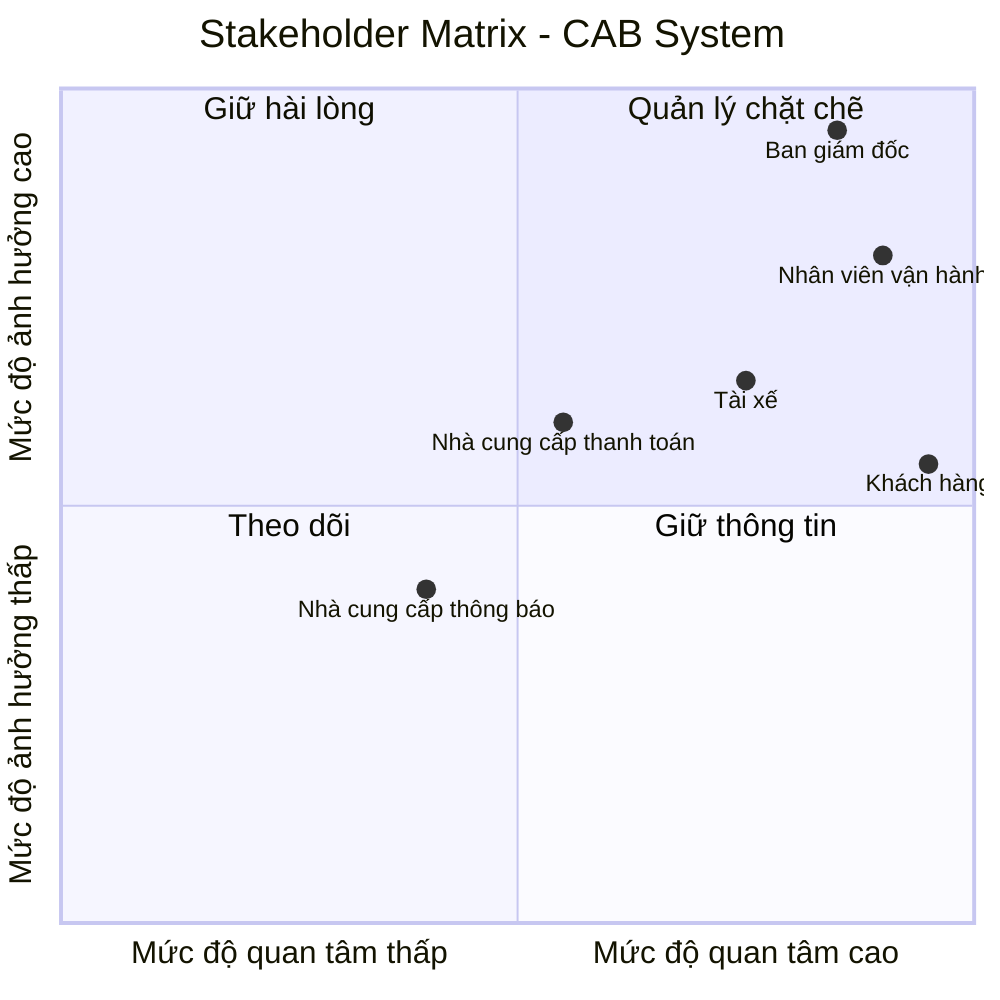
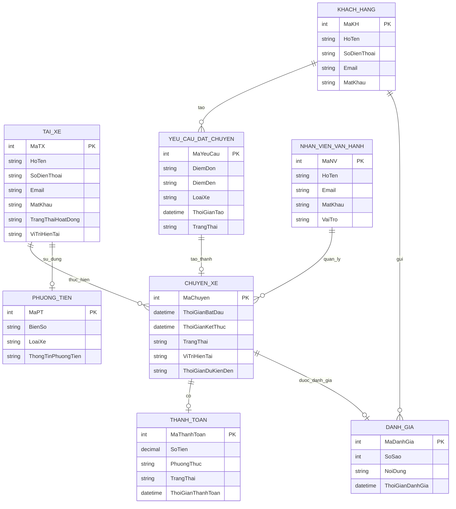

## b1: đọc và phân tích yêu cầu sơ khởi của khách hàng ở giai đoạn 1
- hiểu được business contect : ngữ cảnh nghiệp vụ -> xác định vấn đề nghiệp vụ
Doanh nghiệp: Công ty ABC cung cấp dịch vụ đặt xe trực tuyến.

Sản phẩm/dịch vụ hiện tại:

Khách hàng có thể yêu cầu xe thông qua tổng đài hoặc ứng dụng đơn giản.
Doanh nghiệp có 3 nhóm người dùng chính:
Khách hàng
Tài xế
Nhân viên vận hành

Quy trình nghiệp vụ chính của doanh nghiệp:

Khách hàng tạo yêu cầu đặt xe
→ nhập điểm đón, điểm đến, chọn loại xe
→ hệ thống tìm tài xế phù hợp
→ tài xế nhận/từ chối chuyến
→ nếu từ chối thì tìm tài xế khác
→ tài xế thực hiện chuyến và cập nhật trạng thái
→ tính cước
→ thanh toán
→ thông báo kết quả
→ khách hàng đánh giá tài xế.

....
Vấn đề	Biểu hiện	Hệ quả
Phân công tài xế thủ công	Việc tìm và phân công tài xế chủ yếu do con người thực hiện	Chậm xử lý, khó tối ưu việc tìm tài xế
Khách hàng khó theo dõi chuyến	Không biết rõ đang tìm tài xế nào, tài xế nào nhận, thời gian đến	Trải nghiệm khách hàng chưa tốt
Thanh toán chưa tập trung	Thông tin thanh toán chưa được quản lý tập trung	Khó kiểm soát và tra cứu giao dịch
Khó mở rộng hệ thống	Hệ thống hiện tại có hạn chế khi số lượng khách hàng/tài xế tăng	Khó đáp ứng nhu cầu tăng trưởng
Phụ thuộc nhiều vào xử lý thủ công	Nhiều hoạt động cần nhân viên vận hành theo dõi và xử lý	Tăng khối lượng công việc, dễ xảy ra sai sót
Khó xử lý tình huống ngoại lệ	Chưa xác định rõ cách xử lý từ chối chuyến, mất mạng, thanh toán thất bại...	Quy trình chưa thống nhất

## b2: đã hiểu ngữ cảnh nghiệp vụ, xác định vấn đề nghiệp vụ 
 xác định stakeholder(những bên liên quan của hệ thống)
- lập bảng 2 cột: tên của stakeholder và vai trò của họ

| stakeholder | Vai trò |
|---|---|
| Khách hàng | Tạo yêu cầu, theo dõi chuyến, thanh toán, xem lịch s đánh giá tài xế |
| Tài xế | Nhận chuyến, cập nhật hồ sơ, trạng thái hoạt động, thông tin phương tiện và vị trí |
| Nhân viên vận hành | Quản lý khách hàng, tài xế, phương tiện, chuyến đi; theo dõi các chuyến đang diễn ra hỗ trợ xử lý sự cố và tra cứu giao dịch. |
| Ban giám đốc | Đưa ra định hướng và kỳ vọng đối với hệ thống; theo dõi báo cáo về số lượng chuyến, doanh thu, tỷ lệ hoàn thành, tỷ lệ hủy và hiệu quả hoạt động của tài xế. |
| Nhà cung cấp dịch vụ thanh toán | Cung cấp dịch vụ thanh toán điện tử được tích hợp với hệ thống CAB. |
| Nhà cung cấp dịch vụ thông báo | Hỗ trợ gửi thông báo; doanh nghiệp muốn có khả năng thay đổi hoặc thêm nhà cung cấp trong tương lai |
+ ví dụ khách hàng; đặt xe, thanh toán

- vẽ ma trận stakeholder matric: cho biết tầm ảnh hưởng quan trọng của stakeholder trong hệ thống -> sd công cụ mermaid

## b3: xác định mục tiêu nghiệp vụ:
liệt kê ra
bg01? giảm thời gian tìm tài xế -> hệ thống phải có khả năng tự động tìm tài xế.
bg02? hỗ trợ thanh toán -mđ: cho phép thanh toán bằng tiền mặt và trực tuyến
bg03?

| STT | Mục tiêu nghiệp vụ | Diễn giải |
| :--- | :--- | :--- |
| BG01 | Giảm thời gian tìm tài xế | Rút ngắn thời gian từ khi khách hàng tạo yêu cầu đến khi tìm được tài xế phù hợp. |
| BG02 | Đa dạng hóa và thuận tiện hóa thanh toán | Hỗ trợ khách hàng thanh toán linh hoạt bằng tiền mặt hoặc phương thức điện tử. |
| BG03 | Giảm thao tác phân công thủ công | Giảm sự phụ thuộc vào nhân viên trong việc tìm kiếm và phân công tài xế. |
| BG04 | Tăng tính minh bạch chuyến đi | Giúp khách hàng dễ dàng theo dõi trạng thái, vị trí và thời gian dự kiến của chuyến đi. |
| BG05 | Tối ưu hóa vận hành và quản trị | Hỗ trợ doanh nghiệp quản lý khách hàng, tài xế, phương tiện, chuyến đi và theo dõi hiệu quả hoạt động. |
| BG06 | Đảm bảo tính liên tục của dịch vụ | Duy trì hoạt động ổn định của hệ thống ngay cả khi một thành phần như thanh toán hoặc thông báo gặp sự cố. |
| BG07 | Đảm bảo an toàn và bảo mật | Bảo vệ thông tin cá nhân, dữ liệu vị trí và dữ liệu giao dịch của khách hàng và tài xế. |
| BG08 | Đảm bảo khả năng mở rộng trong tương lai | Cho phép doanh nghiệp dễ dàng bổ sung dịch vụ, phương thức thanh toán, kênh thông báo và các chức năng mới. |
## b4: xác định phạm vi:
- ví dụ: có quản lí khách hàng, tài xế: 
- liệt kê ra các yêu cầu phải làm, các module

| STT | Module | Phạm vi thực hiện |
| :--- | :--- | :--- |
| 1 | **Quản lý khách hàng** | Đăng ký, đăng nhập, cập nhật thông tin cá nhân, xem lịch sử chuyến đi. |
| 2 | **Quản lý tài xế** | Đăng ký/tạo tài khoản, cập nhật hồ sơ, thông tin phương tiện và trạng thái hoạt động. |
| 3 | **Đặt xe** | Nhập điểm đón, điểm đến, lựa chọn loại xe và gửi yêu cầu đặt xe. |
| 4 | **Tìm và phân công tài xế** | Xác định tài xế phù hợp dựa trên vị trí, trạng thái sẵn sàng và các tiêu chí vận hành. |
| 5 | **Quản lý chuyến đi** | Nhận chuyến, cập nhật trạng thái: đã đến điểm đón, đã đón khách, đang di chuyển và hoàn thành chuyến. |
| 6 | **Theo dõi chuyến đi** | Cho phép khách hàng theo dõi trạng thái, vị trí tài xế và thời gian dự kiến tài xế đến. |
| 7 | **Tính cước** | Xác định số tiền khách hàng phải trả dựa trên loại dịch vụ và thông tin chuyến đi. |
| 8 | **Thanh toán** | Hỗ trợ thanh toán bằng tiền mặt và thanh toán điện tử thông qua nhà cung cấp bên ngoài. |
| 9 | **Thông báo** | Gửi thông báo về yêu cầu đặt xe, tài xế nhận chuyến, tài xế đến điểm đón, hoàn thành chuyến và kết quả thanh toán. |
| 10 | **Đánh giá** | Cho phép khách hàng đánh giá tài xế sau khi hoàn thành chuyến. |
| 11 | **Quản lý vận hành** | Quản lý khách hàng, tài xế, phương tiện và chuyến đi; theo dõi các chuyến đang diễn ra và hỗ trợ xử lý sự cố. |
| 12 | **Quản lý giao dịch** | Tra cứu lịch sử giao dịch và thông tin thanh toán. |
| 13 | **Phân quyền** | Kiểm soát quyền truy cập đối với các chức năng quản trị và thao tác nhạy cảm. |
| 14 | **Báo cáo & thống kê** | Báo cáo số lượng chuyến, doanh thu, tỷ lệ hoàn thành, tỷ lệ hủy và hiệu quả hoạt động của tài xế. |
| 15 | **Bảo mật & lưu vết** | Xác thực người dùng, bảo vệ dữ liệu cá nhân/vị trí/giao dịch và lưu vết các thao tác quan trọng. |

- phạm vị không phải / không nên làm.

| STT | Nội dung ngoài phạm vi | Lý do |
| :--- | :--- | :--- |
| 1 | **Chi tiết thuật toán tính cước** | Doanh nghiệp chưa chốt toàn bộ cách tính cước. |
| 2 | **Chi tiết tiêu chí ưu tiên tài xế** | Doanh nghiệp chưa xác định đầy đủ các tiêu chí vận hành. |
| 3 | **Chi tiết thời gian tài xế phải phản hồi** | Chưa được khách hàng chốt. |
| 4 | **Chi tiết chính sách hủy chuyến** | Chưa có chính sách cụ thể từ doanh nghiệp. |
| 5 | **Chi tiết xử lý khi mất kết nối mạng** | Chưa được xác định trong yêu cầu sơ khởi. |
| 6 | **Thời gian lưu trữ dữ liệu cụ thể** | Doanh nghiệp chưa xác định thời gian lưu trữ. |
| 7 | **Lưu trực tiếp thông tin thẻ/tài khoản thanh toán** | Không thuộc phạm vi vì doanh nghiệp yêu cầu tích hợp nhà cung cấp thanh toán bên ngoài và không lưu thông tin nhạy cảm trực tiếp trên CAB. |
| 8 | **Triển khai các dịch vụ mới cụ thể** | Kiến trúc cần hỗ trợ mở rộng trong tương lai, nhưng các dịch vụ mới chưa được xác định để triển khai ở giai đoạn hiện tại. |

## b5: xong bước 4 cần gặp khách hàng xác nhận lại -> oke thì bước qua b5:
chuyển yêu cầu thành business requirement(br)
bảng 3 cột (stt br, tên br, diễn giải)
br01? đặt chuyến xe: hệ thống cho phép khách hàng tạo yêu cầu, cung cấp điểm đến và điểm đi của khách hàng.
br02?
br03?
| STT | Tên BR | Diễn giải |
| :--- | :--- | :--- |
| BR01 | **Đặt chuyến xe** | Hệ thống cho phép khách hàng tạo yêu cầu đặt xe, cung cấp điểm đón, điểm đến và lựa chọn loại xe. |
| BR02 | **Tìm và phân công tài xế** | Hệ thống hỗ trợ tìm và phân công tài xế phù hợp dựa trên vị trí, trạng thái sẵn sàng và các tiêu chí vận hành. |
| BR03 | **Quản lý chuyến đi** | Hệ thống hỗ trợ tài xế tiếp nhận chuyến và cập nhật trạng thái trong quá trình thực hiện chuyến đi. |
| BR04 | **Theo dõi chuyến đi** | Hệ thống cho phép khách hàng theo dõi trạng thái chuyến đi, tài xế nhận chuyến, vị trí và thời gian dự kiến tài xế đến. |
| BR05 | **Quản lý khách hàng** | Hệ thống hỗ trợ khách hàng đăng ký, đăng nhập, cập nhật thông tin cá nhân và xem lịch sử chuyến đi. |
| BR06 | **Quản lý tài xế** | Hệ thống hỗ trợ quản lý tài khoản, hồ sơ, thông tin phương tiện và trạng thái hoạt động của tài xế. |
| BR07 | **Tính cước và thanh toán** | Hệ thống hỗ trợ xác định số tiền khách hàng phải trả và cho phép thanh toán bằng tiền mặt hoặc phương thức điện tử thông qua nhà cung cấp bên ngoài. |
| BR08 | **Quản lý thông báo** | Hệ thống cung cấp thông báo cho khách hàng và tài xế về các sự kiện quan trọng trong quá trình đặt và thực hiện chuyến đi. |
| BR09 | **Đánh giá chuyến đi** | Hệ thống cho phép khách hàng đánh giá tài xế sau khi chuyến đi hoàn thành. |
| BR10 | **Quản lý vận hành** | Hệ thống hỗ trợ nhân viên vận hành quản lý khách hàng, tài xế, phương tiện, chuyến đi, xử lý sự cố và tra cứu giao dịch. |
| BR11 | **Báo cáo và thống kê** | Hệ thống cung cấp báo cáo về số lượng chuyến, doanh thu, tỷ lệ hoàn thành, tỷ lệ hủy và hiệu quả hoạt động của tài xế. |
| BR12 | **Bảo mật và phân quyền** | Hệ thống đảm bảo xác thực người dùng, kiểm soát quyền truy cập, bảo vệ dữ liệu và lưu vết các thao tác quan trọng. |
| BR13 | **Khả năng mở rộng** | Hệ thống có khả năng mở rộng để phục vụ số lượng lớn khách hàng, tài xế và cho phép bổ sung dịch vụ, phương thức thanh toán hoặc kênh thông báo trong tương lai. |
| BR14 | **Đảm bảo tính liên tục của dịch vụ** | Hệ thống cần duy trì hoạt động ổn định khi một thành phần như thanh toán hoặc thông báo gặp sự cố. |

## b6: xây dụng business process:
vd : khách hàng muốn đặt chuyến: tạo chuyến đi - xác nhận điểm đón/ điểm đến - hệ thống xác nhận - tìm tài xế được không? nếu không được phải thông báo cho khách hàng - tìm được tài xế -> tài xế chấp nhận không? không thì phải thông báo cho khách hàng.
BP01:Đặt chuyến xe
khách hàng muốn đặt chuyến: tạo yêu cầu - xác nhận điểm đón/ điểm đến - hệ thống xác nhận - tìm tài xế được không? không được: thông báo cho khách hàng / tìm được tài xế -> tài xế chấp nhận không? không: phải thông báo cho khách hàng và hệ thống thực hiện tìm tài xế khác/ Tài xế chấp nhận -> xác nhận tài xế -> bắt đầu chuyến đi
BP02: Thực hiện chuyến xe
Tài xế đã được xác nhận → tài xế di chuyển đến điểm đón → đến điểm đón? → không: tiếp tục di chuyển / có: thông báo khách hàng → đón khách → bắt đầu di chuyển → đến điểm đến → hoàn thành chuyến.
BP03:Tính cước và thanh toán
Chuyến xe hoàn thành → hệ thống tính cước → hiển thị số tiền → khách hàng chọn phương thức thanh toán → tiền mặt/điện tử → nếu tiền mặt thì tài xế nhận tiền mặt và xác nhận thanh toán thành công/ nếu điện tử thì gửi yêu cầu nhà cung cấp → thanh toán thành công? → không: thông báo thất bại và xử lý lại / có: xác nhận thanh toán → hoàn tất.
BP04:Đánh giá chuyến xe
Chuyến xe hoàn thành → khách hàng xem thông tin chuyến → khách hàng muốn đánh giá? → không: kết thúc / có: đánh giá tài xế → hệ thống ghi nhận đánh giá → kết thúc.

## b7: phân rã yêu cầu nghiệp vụ (fr) (*)
business requirement(br) -> phân rã ? fr

BR01: Đặt chuyến xe
    FR01 Nhập điểm đón
    FR01 Nhập điểm đến
    FR01 Chọn loại xe
    FR01 Gửi yêu cầu đặt chuyến

BR02: Tìm và phân công tài xế
    FR01 Xác định tài xế phù hợp
    FR02 Gửi yêu cầu cho tài xế
    FR03 Xử lý tài xế từ chối/không phản hồi 
    FR04 Tiếp tục tìm tài xế khác

BR03: Quản lý chuyến đi
    FR01: Tài xế nhận chuyến
    FR02: Cập nhật đã đến điểm đón
    FR03: Cập nhật đã đón khách
    FR04: Cập nhật đang di chuyển
    FR05: Cập nhật hoàn thành chuyến

BR04: Theo dõi chuyến đi
    FR01: Hiển thị trạng thái chuyến đi
    FR02: Hiển thị thông tin tài xế
    FR03: Hiển thị vị trí tài xế
    FR04: Hiển thị thời gian dự kiến tài xế đến

BR05: Quản lý khách hàng
    FR01: Đăng ký tài khoản
    FR02: Đăng nhập
    FR03: Cập nhật thông tin cá nhân
    FR04: Xem lịch sử chuyến đi

BR06: Quản lý tài xế
    FR01: Đăng ký hoặc tạo tài khoản tài xế
    FR02: Cập nhật hồ sơ tài xế
    FR03: Quản lý thông tin phương tiện
    FR04: Cập nhật trạng thái hoạt động

BR07: Tính cước và thanh toán
    FR01: Tính cước chuyến xe
    FR02: Hiển thị số tiền phải trả
    FR03: Thanh toán bằng tiền mặt
    FR04: Thanh toán điện tử
    FR05: Xử lý thanh toán thất bại

BR08: Quản lý thông báo
    FR01: Thông báo tiếp nhận yêu cầu đặt xe
    FR02: Thông báo tài xế nhận chuyến
    FR03: Thông báo tài xế đến điểm đón
    FR04: Thông báo hoàn thành chuyến
    FR05: Thông báo kết quả thanh toán

BR09: Đánh giá chuyến xe
    FR01: Hiển thị thông tin chuyến đã hoàn thành
    FR02: Đánh giá tài xế
    FR03: Ghi nhận đánh giá

BR10: Quản lý vận hành
    FR01: Quản lý khách hàng
    FR02: Quản lý tài xế
    FR03: Quản lý phương tiện
    FR04: Theo dõi chuyến đi
    FR05: Xử lý sự cố chuyến đi
    FR06: Tra cứu giao dịch

BR11: Báo cáo và thống kê
    FR01: Báo cáo số lượng chuyến
    FR02: Báo cáo doanh thu
    FR03: Báo cáo tỷ lệ hoàn thành chuyến
    FR04: Báo cáo tỷ lệ hủy chuyến
    FR05: Báo cáo hiệu quả hoạt động của tài xế

BR12: Bảo mật và phân quyền
    FR0: Xác thực người dùng
    FR02: Phân quyền người dùng
    FR03: Bảo vệ dữ liệu
    FR04: Lưu vết các thao tác quan trọng

BR13: Khả năng mở rộng
    FR01: Hỗ trợ bổ sung loại dịch vụ mới
    FR02: Hỗ trợ bổ sung phương thức thanh toán
    FR03: Hỗ trợ bổ sung kênh thông báo

BR14: Đảm bảo tính liên tục của dịch vụ
    FR01: Xử lý lỗi thanh toán độc lập
    FR02: Xử lý lỗi thông báo độc lập
    FR03: Duy trì các chức năng khác khi một thành phần gặp sự cố

## b8: business rule and acception ( những cái luật để khi xảy ra những trường hợp ngoại lệ là xử lí như nào?)
ví dụ:
chỉ những tài xế nào trong trạng thái sẵn sàng thì mới được nhận chuyến --- 
giả sử khách hàng tạo chuyến - chờ tìm tài xế - thời gian lâu quá -> xử lí sao? ( hủy)
giả sử khách hàng tạo chuyến-- tài xế nhận chuyến nhưng quá thời hạn tài xế không chấp nhận - hủy chuyến - chuyển sang tài xế khác ( nhận chuyến và chấp nhận chuyến khác nhau)
------
BR01: Chỉ tài xế ở trạng thái "Sẵn sàng" mới được nhận chuyến.
    Exception:
    - Nếu tài xế không ở trạng thái "Sẵn sàng" thì hệ thống không gửi yêu cầu chuyến đến tài xế đó.

BR02: Khách hàng chỉ được tạo yêu cầu đặt chuyến khi đã cung cấp đầy đủ điểm đón, điểm đến và loại xe.
    Exception:
    - Nếu thiếu thông tin bắt buộc thì hệ thống yêu cầu khách hàng bổ sung thông tin trước khi gửi yêu cầu.

BR03: Khi khách hàng tạo yêu cầu, hệ thống phải tìm tài xế phù hợp.
    Exception:
    - Nếu không tìm được tài xế trong thời gian quy định thì hệ thống thông báo cho khách hàng.
    - Chuyến có thể được hủy theo chính sách của doanh nghiệp.

BR04: Tài xế được hệ thống đề xuất phải phản hồi yêu cầu chuyến trong thời gian quy định.
    Exception:
    - Nếu tài xế không phản hồi trong thời gian quy định thì hệ thống xem như tài xế không nhận chuyến.
    - Hệ thống chuyển sang tìm tài xế phù hợp khác.
    - Khách hàng không cần tạo lại yêu cầu đặt chuyến.

BR05: Tài xế đã nhận chuyến phải thực hiện chuyến theo trạng thái của chuyến đi.
    Exception:
    - Nếu tài xế từ chối chuyến thì hệ thống tiếp tục tìm tài xế khác.
    - Nếu tài xế không phản hồi thì hệ thống tiếp tục tìm tài xế khác.

BR06: Một tài xế không được đồng thời nhận nhiều chuyến không thể thực hiện cùng thời điểm.
    Exception:
    - Nếu tài xế đang thực hiện chuyến thì hệ thống không cho tài xế nhận chuyến mới.

BR07: Khi chuyến xe hoàn thành, hệ thống phải tính cước trước khi thực hiện thanh toán.
    Exception:
    - Nếu không thể tính cước thì hệ thống không thực hiện thanh toán và thông báo cho bộ phận vận hành xử lý.

BR08: Khách hàng có thể thanh toán bằng tiền mặt hoặc phương thức điện tử.
    Exception:
    - Nếu thanh toán điện tử thất bại thì hệ thống thông báo cho khách hàng và cho phép thanh toán lại theo chính sách doanh nghiệp.

BR09: Thông tin thanh toán điện tử nhạy cảm không được lưu trực tiếp trên hệ thống CAB.
    Exception:
    - Nếu giao dịch điện tử thất bại, hệ thống chỉ ghi nhận trạng thái giao dịch và xử lý lại thông qua nhà cung cấp thanh toán.

BR10: Các sự kiện quan trọng của chuyến đi phải được thông báo cho khách hàng và tài xế.
    Exception:
    - Nếu dịch vụ thông báo gặp lỗi thì không được làm dừng toàn bộ quá trình đặt và thực hiện chuyến.
    - Hệ thống tiếp tục xử lý các chức năng chính.

BR11: Chỉ người dùng có quyền phù hợp mới được thực hiện các chức năng quản trị.
    Exception:
    - Nếu người dùng không có quyền thì hệ thống từ chối thao tác và thông báo không đủ quyền truy cập.

BR12: Các thao tác quan trọng trên hệ thống phải được lưu vết.
    Exception:
    - Nếu thao tác không được ghi nhận vào nhật ký thì hệ thống phải ghi nhận lỗi để bộ phận vận hành xử lý.
## b9: data modeling: xây dụng data model: nhìn vô để xác định những thực thể -> vẽ sơ đồ ERD. (sd công cụ mermaid)
1. Các thực thể chính:
KHACH_HANG
- MaKH
- HoTen
- SoDienThoai
- Email
- MatKhau

TAI_XE
- MaTX
- HoTen
- SoDienThoai
- Email
- MatKhau
- TrangThaiHoatDong
- ViTriHienTai

PHUONG_TIEN
- MaPT
- BienSo
- LoaiXe
- ThongTinPhuongTien

YEU_CAU_DAT_CHUYEN
- MaYeuCau
- DiemDon
- DiemDen
- LoaiXe
- ThoiGianTao
- TrangThai

CHUYEN_XE
- MaChuyen
- ThoiGianBatDau
- ThoiGianKetThuc
- TrangThai
- ViTriHienTai
- ThoiGianDuKienDen

THANH_TOAN
- MaThanhToan
- SoTien
- PhuongThuc
- TrangThai
- ThoiGianThanhToan

DANH_GIA
- MaDanhGia
- SoSao
- NoiDung
- ThoiGianDanhGia

NHAN_VIEN_VAN_HANH
- MaNV
- HoTen
- Email
- MatKhau
- VaiTro

2. Sơ đồ:

## b10: xác định những cái non functional requirement:
vd : hệ thống ở giai đoạn mpv: không quan tâm thời gian phản hồi dưới 1ms
    phải thiết kế theo mirco... ( không cần)
1: Hiệu năng
    - Hệ thống hoạt động ổn định khi có nhiều người dùng.
    - Đáp ứng được nhu cầu vào giờ cao điểm.
2: Khả năng mở rộng
    - Có thể mở rộng khi số lượng người dùng tăng.
    - Có thể bổ sung chức năng mới.
3: Tính liên tục
    - Lỗi thanh toán hoặc thông báo không làm dừng hệ thống.
4: Bảo mật
    - Xác thực người dùng và phân quyền quản trị.
    - Bảo vệ thông tin cá nhân, vị trí và giao dịch.
NFR05: Khả năng bảo trì
    - Có thể thay đổi hoặc bổ sung các thành phần của hệ thống dễ dàng.
## b11: xác định và vẽ sơ đồ usecase(UC)

UC01: Đăng ký / Đăng nhập
UC02: Quản lý thông tin khách hàng
UC03: Đặt chuyến xe
UC04: Theo dõi chuyến xe
UC05: Xem lịch sử chuyến xe
UC06: Đánh giá tài xế
UC07: Quản lý tài khoản tài xế
UC08: Quản lý phương tiện
UC09: Nhận chuyến xe
UC10: Thực hiện chuyến xe
UC11: Tìm và phân công tài xế
UC12: Tính cước chuyến xe
UC13: Thanh toán
UC14: Quản lý thông báo
UC15: Quản lý khách hàng
UC16: Quản lý tài xế
UC17: Quản lý phương tiện
UC18: Quản lý chuyến xe
UC19: Xử lý sự cố chuyến xe
UC20: Tra cứu giao dịch
UC21: Báo cáo và thống kê

## b12: đặc tả usecase:
--------

## b13: accesstem ... : những tiêu chí chấp nhận AC
-> tập hợp những điêu kiện, những quy tắc cụ thể mà tính năng có thể đáp ứng -> giúp người làm phần mềm xác định khi nào các yêu được kết thúc, nghiệm thu.
AC01:Khách hàng có thể tạo yêu cầu đặt chuyến với đầy đủ điểm đón, điểm đến và loại xe.
AC02:Hệ thống tìm và phân công tài xế phù hợp cho chuyến đi.
AC03:
ếu tài xế từ chối hoặc không phản hồi, hệ thống tự động tìm tài xế khác.
AC04:Nếu không tìm được tài xế, hệ thống thông báo cho khách hàng.
AC05:Tài xế có thể cập nhật trạng thái trong quá trình thực hiện chuyến.
AC06:Khách hàng có thể theo dõi trạng thái, tài xế và vị trí chuyến đi.
AC07:Sau khi hoàn thành chuyến, hệ thống tính cước và hỗ trợ thanh toán tiền mặt hoặc điện tử.
AC08:Hệ thống xử lý và thông báo khi thanh toán điện tử thất bại.
AC09:Khách hàng có thể xem lịch sử và đánh giá tài xế sau chuyến đi.
AC10:Nhân viên vận hành có thể quản lý và theo dõi khách hàng, tài xế, phương tiện và chuyến xe.
AC11:Hệ thống đảm bảo phân quyền, bảo mật dữ liệu và lưu vết các thao tác quan trọng.
AC12:Hệ thống vẫn duy trì hoạt động khi dịch vụ thanh toán hoặc thông báo gặp sự cố.

## b14: truy xuất nguồn gốc yêu cầu: giúp truy xuất toàn bộ tất cả những gì liên quan: bắt đầu khi nào- thiết kế khi nào - cho tới khi kiểm thử
ma trận truy xuất yêu cầu: (rtm): có các cột: bG, pr(business requirement), fr, uc, ac(5 cột)
bg nào tuong ứng thành pr nào - pr phân rã thành fr nào - fr tưong ứng với uc nào,.......

## B14: Ma trận truy xuất yêu cầu (RTM)

| BG | BR (Business Requirement) | FR (Functional Requirement) | UC (Use Case) | AC (Acceptance Criteria) |
|---|---|---|---|---|
| BG01: Giảm thời gian tìm tài xế | BR02: Tìm và phân công tài xế | FR02.1 Xác định tài xế phù hợp FR02.2 Gửi yêu cầu cho tài xế FR02.3 Xử lý từ chối/không phản hồi FR02.4 Tìm tài xế khác | UC11: Tìm và phân công tài xế | AC02, AC03, AC04 |
| BG02: Đa dạng hóa và thuận tiện hóa thanh toán | BR07: Tính cước và thanh toán | FR07.1 Tính cước FR07.2 Hiển thị số tiền FR07.3 Thanh toán tiền mặt FR07.4 Thanh toán điện tử FR07.5 Xử lý thanh toán thất bại | UC12: Tính cước UC13: Thanh toán | AC07, AC08 |
| BG03: Giảm thao tác phân công thủ công | BR02: Tìm và phân công tài xế | FR02.1 Xác định tài xế phù hợp FR02.2 Gửi yêu cầu cho tài xế FR02.4 Tìm tài xế khác | UC11: Tìm và phân công tài xế | AC02, AC03 |
| BG04: Tăng tính minh bạch chuyến đi | BR04: Theo dõi chuyến đi | FR04.1 Hiển thị trạng thái FR04.2 Hiển thị tài xế FR04.3 Hiển thị vị trí FR04.4 Hiển thị ETA | UC04: Theo dõi chuyến xe | AC06 |
| BG05: Tối ưu hóa vận hành và quản trị | BR10: Quản lý vận hành BR11: Báo cáo và thống kê | FR10.1 - FR10.6 FR11.1 - FR11.5 | UC15 - UC20 UC21: Báo cáo và thống kê | AC10 |
| BG06: Đảm bảo tính liên tục của dịch vụ | BR14: Đảm bảo tính liên tục | FR14.1 Xử lý lỗi thanh toán FR14.2 Xử lý lỗi thông báo FR14.3 Duy trì chức năng khác | UC13: Thanh toán UC14: Quản lý thông báo | AC12 |
| BG07: Đảm bảo an toàn và bảo mật | BR12: Bảo mật và phân quyền | FR12.1 Xác thực FR12.2 Phân quyền FR12.3 Bảo vệ dữ liệu FR12.4 Lưu vết | UC01: Đăng ký / Đăng nhập UC22: Quản lý phân quyền UC23: Quản lý bảo mật | AC11 |
| BG08: Đảm bảo khả năng mở rộng | BR13: Khả năng mở rộng | FR13.1 Bổ sung dịch vụ FR13.2 Bổ sung phương thức thanh toán FR13.3 Bổ sung kênh thông báo | UC12: Thanh toán UC14: Quản lý thông báo | — |
