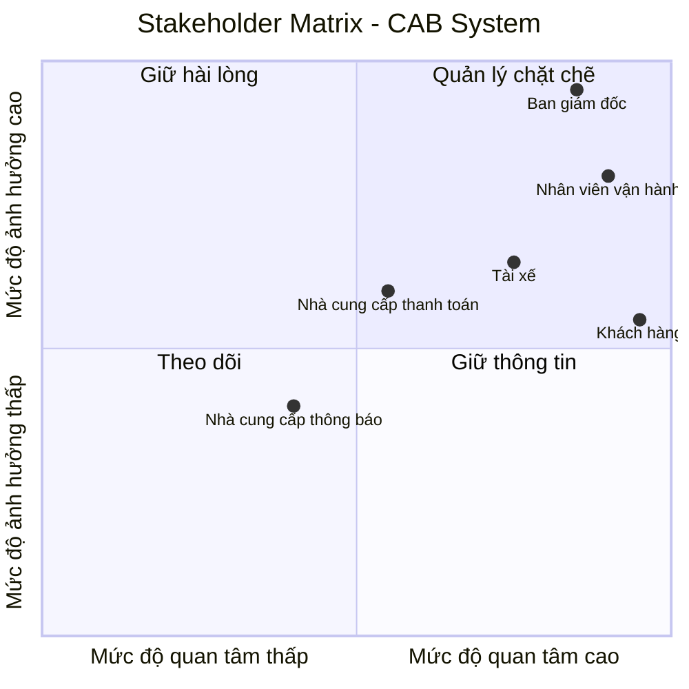
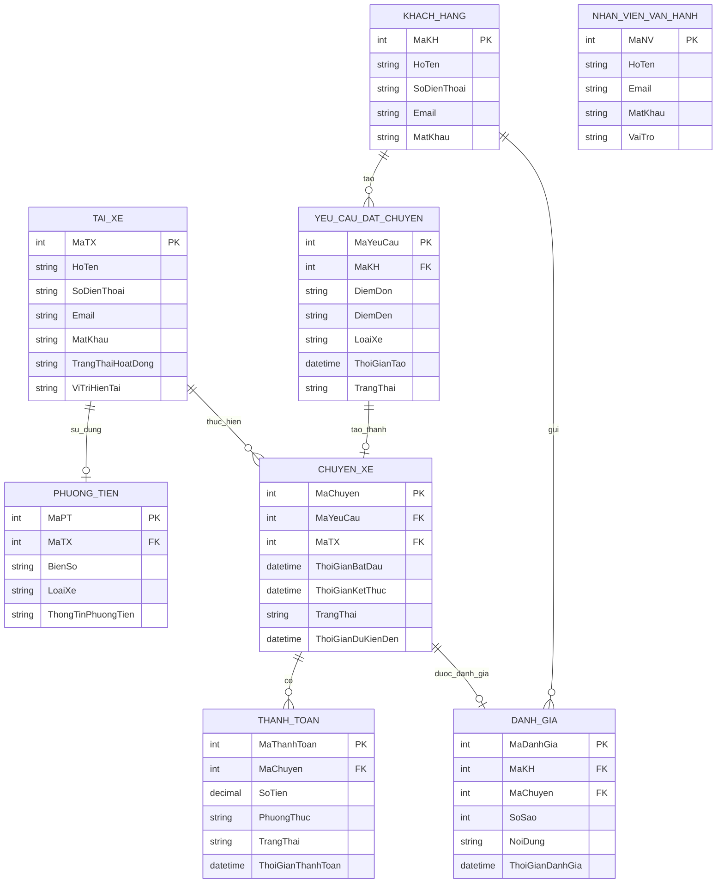
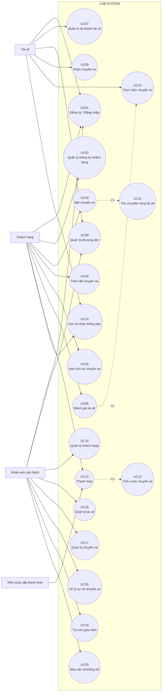

## b1: đọc và phân tích yêu cầu sơ khởi của khách hàng ở giai đoạn 1
- hiểu được business contect : ngữ cảnh nghiệp vụ -> xác định vấn đề nghiệp vụ
Doanh nghiệp: Công ty ABC cung cấp dịch vụ đặt xe trực tuyến.

Sản phẩm/dịch vụ hiện tại:

Khách hàng có thể yêu cầu xe thông qua tổng đài hoặc ứng dụng đơn giản.
Doanh nghiệp có 3 nhóm người dùng chính:
Khách hàng
Tài xế
Nhân viên vận hành

Quy trình nghiệp vụ chính của doanh nghiệp:

Khách hàng tạo yêu cầu đặt xe
→ nhập điểm đón, điểm đến, chọn loại xe
→ hệ thống tìm tài xế phù hợp
→ tài xế nhận/từ chối chuyến
→ nếu từ chối thì tìm tài xế khác
→ tài xế thực hiện chuyến và cập nhật trạng thái
→ tính cước
→ thanh toán
→ thông báo kết quả
→ khách hàng đánh giá tài xế.

....
Vấn đề	Biểu hiện	Hệ quả
Phân công tài xế thủ công	Việc tìm và phân công tài xế chủ yếu do con người thực hiện	Chậm xử lý, khó tối ưu việc tìm tài xế
Khách hàng khó theo dõi chuyến	Không biết rõ đang tìm tài xế nào, tài xế nào nhận, thời gian đến	Trải nghiệm khách hàng chưa tốt
Thanh toán chưa tập trung	Thông tin thanh toán chưa được quản lý tập trung	Khó kiểm soát và tra cứu giao dịch
Khó mở rộng hệ thống	Hệ thống hiện tại có hạn chế khi số lượng khách hàng/tài xế tăng	Khó đáp ứng nhu cầu tăng trưởng
Phụ thuộc nhiều vào xử lý thủ công	Nhiều hoạt động cần nhân viên vận hành theo dõi và xử lý	Tăng khối lượng công việc, dễ xảy ra sai sót
Khó xử lý tình huống ngoại lệ	Chưa xác định rõ cách xử lý từ chối chuyến, mất mạng, thanh toán thất bại...	Quy trình chưa thống nhất

## b2: đã hiểu ngữ cảnh nghiệp vụ, xác định vấn đề nghiệp vụ 
 xác định stakeholder(những bên liên quan của hệ thống)
- lập bảng 2 cột: tên của stakeholder và vai trò của họ

| stakeholder | Vai trò |
|---|---|
| Khách hàng | Tạo yêu cầu, theo dõi chuyến, thanh toán, xem lịch s đánh giá tài xế |
| Tài xế | Nhận chuyến, cập nhật hồ sơ, trạng thái hoạt động, thông tin phương tiện và vị trí |
| Nhân viên vận hành | Quản lý khách hàng, tài xế, phương tiện, chuyến đi; theo dõi các chuyến đang diễn ra hỗ trợ xử lý sự cố và tra cứu giao dịch. |
| Ban giám đốc | Đưa ra định hướng và kỳ vọng đối với hệ thống; theo dõi báo cáo về số lượng chuyến, doanh thu, tỷ lệ hoàn thành, tỷ lệ hủy và hiệu quả hoạt động của tài xế. |
| Nhà cung cấp dịch vụ thanh toán | Cung cấp dịch vụ thanh toán điện tử được tích hợp với hệ thống CAB. |
| Nhà cung cấp dịch vụ thông báo | Hỗ trợ gửi thông báo; doanh nghiệp muốn có khả năng thay đổi hoặc thêm nhà cung cấp trong tương lai |
+ ví dụ khách hàng; đặt xe, thanh toán

- vẽ ma trận stakeholder matric: cho biết tầm ảnh hưởng quan trọng của stakeholder trong hệ thống -> sd công cụ mermaid

## b3: xác định mục tiêu nghiệp vụ:
liệt kê ra
bg01? giảm thời gian tìm tài xế -> hệ thống phải có khả năng tự động tìm tài xế.
bg02? hỗ trợ thanh toán -mđ: cho phép thanh toán bằng tiền mặt và trực tuyến
bg03?

| STT | Mục tiêu nghiệp vụ | Diễn giải |
| :--- | :--- | :--- |
| BG01 | Giảm thời gian tìm tài xế | Rút ngắn thời gian tìm kiếm và phân công tài xế phù hợp cho khách hàng. |
| BG02 | Đa dạng hóa và thuận tiện hóa thanh toán | Hỗ trợ khách hàng thanh toán linh hoạt bằng tiền mặt hoặc phương thức điện tử. |
| BG03 | Giảm thao tác phân công thủ công | Giảm sự phụ thuộc vào nhân viên trong việc tìm kiếm và phân công tài xế. |
| BG04 | Tăng tính minh bạch chuyến đi | Giúp khách hàng dễ dàng theo dõi trạng thái, vị trí và thời gian dự kiến của chuyến đi. |
| BG05 | Tối ưu hóa vận hành và quản trị | Hỗ trợ doanh nghiệp quản lý khách hàng, tài xế, phương tiện, chuyến đi và theo dõi hiệu quả hoạt động. |
| BG06 | Đảm bảo tính liên tục của dịch vụ | Duy trì hoạt động ổn định của hệ thống ngay cả khi một thành phần như thanh toán hoặc thông báo gặp sự cố. |
| BG07 | Đảm bảo an toàn và bảo mật | Bảo vệ thông tin cá nhân, dữ liệu vị trí và dữ liệu giao dịch của khách hàng và tài xế. |
| BG08 | Đảm bảo khả năng mở rộng trong tương lai | Cho phép doanh nghiệp dễ dàng bổ sung dịch vụ, phương thức thanh toán, kênh thông báo và các chức năng mới. |
## b4: xác định phạm vi:
- ví dụ: có quản lí khách hàng, tài xế: 
- liệt kê ra các yêu cầu phải làm, các module

| STT | Module | Phạm vi thực hiện |
| :--- | :--- | :--- |
| 1 | **Quản lý khách hàng** | Đăng ký, đăng nhập, cập nhật thông tin cá nhân, xem lịch sử chuyến đi. |
| 2 | **Quản lý tài xế** | Đăng ký/tạo tài khoản, cập nhật hồ sơ, thông tin phương tiện và trạng thái hoạt động. |
| 3 | **Đặt xe** | Nhập điểm đón, điểm đến, lựa chọn loại xe và gửi yêu cầu đặt xe. |
| 4 | **Tìm và phân công tài xế** | Xác định tài xế phù hợp dựa trên vị trí, trạng thái sẵn sàng và các tiêu chí vận hành. |
| 5 | **Quản lý chuyến đi** | Nhận chuyến, cập nhật trạng thái: đã đến điểm đón, đã đón khách, đang di chuyển và hoàn thành chuyến. |
| 6 | **Theo dõi chuyến đi** | Cho phép khách hàng theo dõi trạng thái, vị trí tài xế và thời gian dự kiến tài xế đến. |
| 7 | **Tính cước** | Xác định số tiền khách hàng phải trả dựa trên loại dịch vụ và thông tin chuyến đi. |
| 8 | **Thanh toán** | Hỗ trợ thanh toán bằng tiền mặt và thanh toán điện tử thông qua nhà cung cấp bên ngoài. |
| 9 | **Thông báo** | Gửi thông báo về yêu cầu đặt xe, tài xế nhận chuyến, tài xế đến điểm đón, hoàn thành chuyến và kết quả thanh toán. |
| 10 | **Đánh giá** | Cho phép khách hàng đánh giá tài xế sau khi hoàn thành chuyến. |
| 11 | **Quản lý vận hành** | Quản lý khách hàng, tài xế, phương tiện và chuyến đi; theo dõi các chuyến đang diễn ra và hỗ trợ xử lý sự cố. |
| 12 | **Quản lý giao dịch** | Tra cứu lịch sử giao dịch và thông tin thanh toán. |
| 13 | **Phân quyền** | Kiểm soát quyền truy cập đối với các chức năng quản trị và thao tác nhạy cảm. |
| 14 | **Báo cáo & thống kê** | Báo cáo số lượng chuyến, doanh thu, tỷ lệ hoàn thành, tỷ lệ hủy và hiệu quả hoạt động của tài xế. |
| 15 | **Bảo mật & lưu vết** | Xác thực người dùng, bảo vệ dữ liệu cá nhân/vị trí/giao dịch và lưu vết các thao tác quan trọng. |

- phạm vị không phải / không nên làm.

| STT | Nội dung ngoài phạm vi | Lý do |
| :--- | :--- | :--- |
| 1 | **Chi tiết thuật toán tính cước** | Doanh nghiệp chưa chốt toàn bộ cách tính cước. |
| 2 | **Chi tiết tiêu chí ưu tiên tài xế** | Doanh nghiệp chưa xác định đầy đủ các tiêu chí vận hành. |
| 3 | **Chi tiết thời gian tài xế phải phản hồi** | Chưa được khách hàng chốt. |
| 4 | **Chi tiết chính sách hủy chuyến** | Chưa có chính sách cụ thể từ doanh nghiệp. |
| 5 | **Chi tiết xử lý khi mất kết nối mạng** | Chưa được xác định trong yêu cầu sơ khởi. |
| 6 | **Thời gian lưu trữ dữ liệu cụ thể** | Doanh nghiệp chưa xác định thời gian lưu trữ. |
| 7 | **Lưu trực tiếp thông tin thẻ/tài khoản thanh toán** | Không thuộc phạm vi vì doanh nghiệp yêu cầu tích hợp nhà cung cấp thanh toán bên ngoài và không lưu thông tin nhạy cảm trực tiếp trên CAB. |
| 8 | **Triển khai các dịch vụ mới cụ thể** | Kiến trúc cần hỗ trợ mở rộng trong tương lai, nhưng các dịch vụ mới chưa được xác định để triển khai ở giai đoạn hiện tại. |

## b5: xong bước 4 cần gặp khách hàng xác nhận lại -> oke thì bước qua b5:

chuyển yêu cầu thành business requirement(br)
bảng 3 cột (stt br, tên br, diễn giải)
br01? đặt chuyến xe: hệ thống cho phép khách hàng tạo yêu cầu, cung cấp điểm đến và điểm đi của khách hàng.
br02?
br03?

| STT | Tên BR | Diễn giải |
| :--- | :--- | :--- |
| BR01 | **Đặt chuyến xe** | Hệ thống cho phép khách hàng tạo yêu cầu đặt xe, cung cấp điểm đón, điểm đến và lựa chọn loại xe. |
| BR02 | **Tìm và phân công tài xế** | Hệ thống hỗ trợ tìm và phân công tài xế phù hợp dựa trên vị trí, trạng thái sẵn sàng và các tiêu chí vận hành. |
| BR03 | **Quản lý chuyến đi** | Hệ thống hỗ trợ tài xế tiếp nhận chuyến và cập nhật trạng thái trong quá trình thực hiện chuyến đi. |
| BR04 | **Theo dõi chuyến đi** | Hệ thống cho phép khách hàng theo dõi trạng thái chuyến đi, tài xế nhận chuyến, vị trí và thời gian dự kiến tài xế đến. |
| BR05 | **Quản lý khách hàng** | Hệ thống hỗ trợ khách hàng đăng ký, đăng nhập, cập nhật thông tin cá nhân và xem lịch sử chuyến đi. |
| BR06 | **Quản lý tài xế** | Hệ thống hỗ trợ quản lý tài khoản, hồ sơ, thông tin phương tiện và trạng thái hoạt động của tài xế. |
| BR07 | **Tính cước và thanh toán** | Hệ thống hỗ trợ xác định số tiền khách hàng phải trả và cho phép thanh toán bằng tiền mặt hoặc phương thức điện tử thông qua nhà cung cấp bên ngoài. |
| BR08 | **Quản lý thông báo** | Hệ thống cung cấp thông báo cho khách hàng và tài xế về các sự kiện quan trọng trong quá trình đặt và thực hiện chuyến đi. |
| BR09 | **Đánh giá chuyến đi** | Hệ thống cho phép khách hàng đánh giá tài xế sau khi chuyến đi hoàn thành. |
| BR10 | **Quản lý vận hành** | Hệ thống hỗ trợ nhân viên vận hành quản lý khách hàng, tài xế, phương tiện, chuyến đi, xử lý sự cố và tra cứu giao dịch. |
| BR11 | **Báo cáo và thống kê** | Hệ thống cung cấp báo cáo về số lượng chuyến, doanh thu, tỷ lệ hoàn thành, tỷ lệ hủy và hiệu quả hoạt động của tài xế. |
| BR12 | **Bảo mật, phân quyền và lưu vết** | Hệ thống đảm bảo xác thực người dùng, kiểm soát quyền truy cập, bảo vệ dữ liệu và lưu vết các thao tác quan trọng. |
| BR13 | **Khả năng mở rộng** | Hệ thống có khả năng mở rộng các thành phần độc lập khi tải tăng và cho phép bổ sung dịch vụ, phương thức thanh toán, kênh thông báo hoặc các chức năng mới trong tương lai. |
| BR14 | **Đảm bảo tính liên tục của dịch vụ** | Hệ thống cần duy trì hoạt động ổn định khi một thành phần như thanh toán hoặc thông báo gặp sự cố. |

## b6: xây dụng business process:
vd : khách hàng muốn đặt chuyến: tạo chuyến đi - xác nhận điểm đón/ điểm đến - hệ thống xác nhận - tìm tài xế được không? nếu không được phải thông báo cho khách hàng - tìm được tài xế -> tài xế chấp nhận không? không thì phải thông báo cho khách hàng.
BP01: Quản lí khách hàng: Khách hàng đăng ký/đăng nhập, cập nhật thông tin cá nhân và tra cứu lịch sử chuyến đi.

BP02: Quản lí tài xế: Tài xế đăng ký
Nhân viên tạo tài khoản/ Cập nhật hồ sơ -> Cập nhật thông tin phương tiện -> Cập nhật trạng thái hoạt động -> Sẵn sàng nhận chuyến

BP03:Đặt chuyến xe
Tạo yêu cầu → nhập điểm đón/điểm đến → chọn loại xe → hệ thống tiếp nhận → tìm tài xế → tài xế chấp nhận? → xác nhận tài xế / tìm tài xế khác → chuyển sang thực hiện chuyến

BP04: Thực hiện chuyến xe
Tài xế được xác nhận → di chuyển đến điểm đón → đã đến? → thông báo khách hàng → đón khách → di chuyển → đến điểm đến → hoàn thành chuyến

BP05:Tính cước và thanh toán
Chuyến hoàn thành → tính cước → hiển thị số tiền → chọn phương thức → tiền mặt/điện tử → xử lý thanh toán → thành công/thất bại → thông báo → hoàn tất.

BP06:Đánh giá chuyến xe
Chuyến hoàn thành → khách hàng xem thông tin → muốn đánh giá? → đánh giá tài xế → hệ thống ghi nhận → kết thúc.

## b7: phân rã yêu cầu nghiệp vụ (fr) (*)
business requirement(br) -> phân rã ? fr

BR01: Đặt chuyến xe
    FR01: Nhập điểm đón
    FR02: Nhập điểm đến
    FR03: Chọn loại xe
    FR04: Gửi yêu cầu đặt chuyến

BR02: Tìm và phân công tài xế
    FR01: Xác định tài xế phù hợp
    FR02: Gửi yêu cầu nhận chuyến cho tài xế
    FR03: Xử lý trường hợp tài xế từ chối hoặc không phản hồi
    FR04: Tiếp tục tìm và đề xuất tài xế khác
    FR05: Thông báo cho khách hàng khi không tìm được tài xế

BR03: Quản lý chuyến đi
    FR01: Tài xế tiếp nhận chuyến
    FR02: Cập nhật trạng thái đã đến điểm đón
    FR03: Cập nhật trạng thái đã đón khách
    FR04: Cập nhật trạng thái đang di chuyển
    FR05: Cập nhật trạng thái hoàn thành chuyến

BR04: Theo dõi chuyến đi
    FR01: Hiển thị trạng thái chuyến đi
    FR02: Hiển thị thông tin tài xế
    FR03: Hiển thị vị trí tài xế
    FR04: Hiển thị thời gian dự kiến tài xế đến

BR05: Quản lý khách hàng
    FR01: Đăng ký tài khoản
    FR02: Đăng nhập
    FR03: Cập nhật thông tin cá nhân
    FR04: Xem lịch sử chuyến đi

BR06: Quản lý tài xế
    FR01: Đăng ký hoặc tạo tài khoản tài xế
    FR02: Cập nhật hồ sơ tài xế
    FR03: Quản lý thông tin phương tiện
    FR04: Cập nhật trạng thái hoạt động

BR07: Tính cước và thanh toán
    FR01: Xác định số tiền phải trả cho chuyến xe
    FR02: Hiển thị số tiền phải trả
    FR03: Hỗ trợ thanh toán bằng tiền mặt
    FR04: Hỗ trợ thanh toán điện tử thông qua nhà cung cấp bên ngoài
    FR05: Thông báo kết quả thanh toán cho khách hàng
    FR06: Xử lý lại giao dịch khi thanh toán điện tử thất bại

BR08: Quản lý thông báo
    FR01: Thông báo tiếp nhận yêu cầu đặt xe
    FR02: Thông báo tài xế nhận chuyến
    FR03: Thông báo tài xế đến điểm đón
    FR04: Thông báo hoàn thành chuyến
    FR05: Thông báo kết quả thanh toán

BR09: Đánh giá chuyến xe
    FR01: Cho phép khách hàng đánh giá tài xế sau khi chuyến hoàn thành
    FR02: Ghi nhận đánh giá

BR10: Quản lý vận hành
    FR01: Quản lý khách hàng
    FR02: Quản lý tài xế
    FR03: Quản lý phương tiện
    FR04: Theo dõi chuyến đi
    FR05: Xử lý sự cố chuyến đi
    FR06: Tra cứu giao dịch

BR11: Báo cáo và thống kê
    FR01: Báo cáo số lượng chuyến
    FR02: Báo cáo doanh thu
    FR03: Báo cáo tỷ lệ hoàn thành chuyến
    FR04: Báo cáo tỷ lệ hủy chuyến
    FR05: Báo cáo hiệu quả hoạt động của tài xế

BR12: Bảo mật và phân quyền
    FR0: Xác thực người dùng
    FR02: Phân quyền người dùng
    FR03: Bảo vệ dữ liệu
    FR04: Lưu vết các thao tác quan trọng

BR13: Khả năng mở rộng
    FR01: Hỗ trợ mở rộng các thành phần của hệ thống độc lập khi tải tăng
    FR02: Hỗ trợ bổ sung loại dịch vụ mới
    FR03: Hỗ trợ bổ sung phương thức thanh toán mới
    FR04: Hỗ trợ bổ sung kênh thông báo mới
    FR05: Hỗ trợ triển khai chức năng mới từng phần với ảnh hưởng hạn chế đến chức năng đang hoạt động
    FR06: Cho phép thay đổi một số thành phần kỹ thuật mà không phải xây dựng lại toàn bộ ứng dụng

BR14: Đảm bảo tính liên tục của dịch vụ
    FR01: Duy trì hoạt động của hệ thống đặt xe khi chức năng thanh toán gặp sự cố
    FR02: Duy trì hoạt động của hệ thống đặt xe khi chức năng thông báo gặp sự cố
    FR03: Đảm bảo các chức năng không bị ảnh hưởng tiếp tục hoạt động khi một thành phần gặp sự cố

## b8: business rule and acception ( những cái luật để khi xảy ra những trường hợp ngoại lệ là xử lí như nào?)
ví dụ:
chỉ những tài xế nào trong trạng thái sẵn sàng thì mới được nhận chuyến --- 
giả sử khách hàng tạo chuyến - chờ tìm tài xế - thời gian lâu quá -> xử lí sao? ( hủy)
giả sử khách hàng tạo chuyến-- tài xế nhận chuyến nhưng quá thời hạn tài xế không chấp nhận - hủy chuyến - chuyển sang tài xế khác ( nhận chuyến và chấp nhận chuyến khác nhau)
------
BR01 – Trạng thái sẵn sàng của tài xế
Chỉ tài xế ở trạng thái “Sẵn sàng” mới được hệ thống lựa chọn để nhận chuyến.
Exception:
Nếu tài xế không ở trạng thái “Sẵn sàng”, hệ thống không gửi yêu cầu chuyến đến tài xế đó.
Hệ thống tiếp tục tìm tài xế khác phù hợp.

BR02 – Thông tin bắt buộc khi đặt chuyến
Khách hàng chỉ được gửi yêu cầu đặt chuyến khi đã cung cấp đầy đủ điểm đón, điểm đến và loại xe.
Exception:
Nếu thiếu một hoặc nhiều thông tin bắt buộc, hệ thống yêu cầu khách hàng bổ sung thông tin.
Hệ thống không gửi yêu cầu đặt chuyến cho đến khi thông tin bắt buộc được cung cấp đầy đủ.

BR03 – Tìm kiếm tài xế phù hợp
Khi khách hàng gửi yêu cầu đặt chuyến, hệ thống phải tìm tài xế phù hợp dựa trên vị trí, trạng thái sẵn sàng và các tiêu chí vận hành.
Exception:
Nếu không tìm được tài xế phù hợp, hệ thống thông báo cho khách hàng.
Việc xử lý/hủy chuyến được thực hiện theo chính sách của doanh nghiệp.
 *** Lưu ý: Thời gian tìm tài xế cụ thể chưa được xác định trong Customer Requirement.

BR04 – Phản hồi yêu cầu chuyến của tài xế
Tài xế được hệ thống đề xuất phải phản hồi yêu cầu chuyến trong thời gian phản hồi được doanh nghiệp quy định.
Exception:
Nếu tài xế từ chối chuyến, hệ thống tiếp tục tìm tài xế phù hợp khác.
Nếu tài xế không phản hồi trong thời gian quy định, hệ thống xem như tài xế không nhận chuyến.
Hệ thống tiếp tục tìm tài xế phù hợp khác.
Khách hàng không cần tạo lại yêu cầu đặt chuyến.
*** Thời gian phản hồi cụ thể của tài xế chưa được xác định trong Customer Requirement.

BR05 – Cập nhật trạng thái chuyến đi
Tài xế đã nhận chuyến phải cập nhật trạng thái chuyến đi theo quá trình thực hiện chuyến.
- Các trạng thái chính gồm:
    Đã đến điểm đón
    Đã đón khách
    Đang di chuyển
    Hoàn thành chuyến
Exception:
Nếu tài xế không thể tiếp tục thực hiện chuyến, chuyến đi được chuyển sang quy trình xử lý sự cố của bộ phận vận hành.

BR06 – Trạng thái hoạt động của tài xế
Tài xế phải cập nhật trạng thái hoạt động của mình trên hệ thống để hệ thống xác định khả năng nhận chuyến.
Exception:
Nếu tài xế không ở trạng thái “Sẵn sàng”, hệ thống không lựa chọn tài xế đó cho yêu cầu chuyến mới.

BR07 – Tính cước trước khi thanh toán
Sau khi chuyến xe hoàn thành, hệ thống phải tính toán số tiền phải trả dựa trên loại dịch vụ và thông tin chuyến đi trước khi thực hiện thanh toán.
Exception:
Nếu hệ thống không thể xác định số tiền phải trả, hệ thống không thực hiện thanh toán.
Hệ thống ghi nhận tình trạng lỗi để xử lý.
*** Công thức tính cước chi tiết hiện chưa được xác định trong Customer Requirement.

BR08 – Phương thức thanh toán
Khách hàng được phép thanh toán bằng tiền mặt hoặc phương thức thanh toán điện tử.
Exception:
Nếu thanh toán điện tử thất bại, hệ thống thông báo kết quả thất bại cho khách hàng.
Hệ thống cho phép khách hàng thực hiện lại thanh toán theo chính sách của doanh nghiệp.

BR09 – Bảo vệ thông tin thanh toán điện tử
Hệ thống CAB không được lưu trữ trực tiếp thông tin thanh toán điện tử nhạy cảm như thông tin thẻ hoặc tài khoản thanh toán.
Exception:
Khi thanh toán điện tử thất bại, hệ thống chỉ ghi nhận trạng thái giao dịch cần thiết.
Việc thực hiện lại giao dịch được xử lý thông qua nhà cung cấp dịch vụ thanh toán bên ngoài.

BR10 – Thông báo các sự kiện quan trọng
Các sự kiện quan trọng trong quá trình đặt và thực hiện chuyến phải được thông báo cho người dùng liên quan.
- Các sự kiện chính gồm:
    Tiếp nhận yêu cầu đặt chuyến.
    Tài xế nhận chuyến.
    Tài xế đến điểm đón.
    Chuyến đi hoàn thành.
    Kết quả thanh toán.
    Chuyến mới hoặc thay đổi liên quan đến chuyến đối với tài xế.
Exception:
    Nếu dịch vụ thông báo gặp sự cố, lỗi của dịch vụ thông báo không được làm dừng toàn bộ quá trình đặt và thực hiện chuyến.
    Hệ thống tiếp tục xử lý các chức năng chính không bị ảnh hưởng.

BR11 – Phân quyền chức năng quản trị
Chỉ người dùng có quyền phù hợp mới được thực hiện các chức năng quản trị của hệ thống.
Exception:
Nếu người dùng không có quyền thực hiện chức năng, hệ thống từ chối thao tác.
Hệ thống thông báo cho người dùng rằng họ không có quyền truy cập chức năng đó.

BR12 – Lưu vết thao tác quan trọng
Các thao tác quan trọng trên hệ thống phải được lưu vết (audit log) để phục ụ việc kiểm tra và quản lý.
Exception:
Nếu thao tác không được ghi nhận vào nhật ký, hệ thống phải ghi nhận tình trạng lỗi.

## b9: data modeling: xây dụng data model: nhìn vô để xác định những thực thể -> vẽ sơ đồ ERD. (sd công cụ mermaid)
- Các thực thể chính:
1. KHACH_HANG
MaKH – Mã khách hàng
HoTen – Họ tên khách hàng
SoDienThoai – Số điện thoại
Email – Địa chỉ email
MatKhau – Mật khẩu tài khoản

2. TAI_XE
MaTX – Mã tài xế
HoTen – Họ tên tài xế
SoDienThoai – Số điện thoại
Email – Địa chỉ email
MatKhau – Mật khẩu tài khoản
TrangThaiHoatDong – Trạng thái hoạt động của tài xế
ViTriHienTai – Vị trí hiện tại của tài xế

3. PHUONG_TIEN
MaPT – Mã phương tiện
MaTX – Mã tài xế
BienSo – Biển số xe
LoaiXe – Loại xe
ThongTinPhuongTien – Thông tin phương tiện

4. YEU_CAU_DAT_CHUYEN
MaYeuCau – Mã yêu cầu đặt chuyến
MaKH – Mã khách hàng
DiemDon – Điểm đón
DiemDen – Điểm đến
LoaiXe – Loại xe khách hàng yêu cầu
ThoiGianTao – Thời gian tạo yêu cầu
TrangThai – Trạng thái yêu cầu

5. CHUYEN_XE
MaChuyen – Mã chuyến xe
MaYeuCau – Mã yêu cầu đặt chuyến
MaTX – Mã tài xế thực hiện chuyến
ThoiGianBatDau – Thời gian bắt đầu chuyến
ThoiGianKetThuc – Thời gian kết thúc chuyến
TrangThai – Trạng thái chuyến xe
ThoiGianDuKienDen – Thời gian dự kiến tài xế đến

6. THANH_TOAN
MaThanhToan – Mã thanh toán
MaChuyen – Mã chuyến xe
SoTien – Số tiền thanh toán
PhuongThuc – Phương thức thanh toán
TrangThai – Trạng thái thanh toán
ThoiGianThanhToan – Thời gian thanh toán

***Hệ thống CAB không lưu trực tiếp thông tin thanh toán điện tử nhạy cảm. Các giao dịch điện tử được thực hiện thông qua nhà cung cấp dịch vụ thanh toán bên ngoài.

7. DANH_GIA
MaDanhGia – Mã đánh giá
MaKH – Mã khách hàng
MaChuyen – Mã chuyến xe
SoSao – Số sao đánh giá
NoiDung – Nội dung đánh giá
ThoiGianDanhGia – Thời gian đánh giá

8. NHAN_VIEN_VAN_HANH
MaNV – Mã nhân viên
HoTen – Họ tên nhân viên
Email – Địa chỉ email
MatKhau – Mật khẩu tài khoản
VaiTro – Vai trò và quyền hạn của nhân viên

2. Sơ đồ:

## b10: xác định những cái non functional requirement:
vd : hệ thống ở giai đoạn mpv: không quan tâm thời gian phản hồi dưới 1ms
    phải thiết kế theo mirco... ( không cần)
1: Hiệu năng
    - Hệ thống phải hoạt động ổn định khi có nhiều người dùng đồng thời.
    - Hệ thống phải đáp ứng được nhu cầu sử dụng trong giờ cao điểm.
    - Quá trình đặt chuyến, tìm tài xế và theo dõi chuyến phải được xử lý ổn định trong điều kiện tải cao.
2: Khả năng mở rộng
    - Hệ thống phải có khả năng mở rộng khi số lượng người dùng và số lượng chuyến tăng.
    - Các thành phần của hệ thống phải có khả năng mở rộng độc lập khi tải tăng.
    - Hệ thống phải cho phép bổ sung các chức năng mới mà không ảnh hưởng lớn đến các chức năng hiện có.
3: Tính liên tục và khả năng chịu lỗi
    - Sự cố của thành phần thanh toán không được làm dừng toàn bộ hệ thống đặt chuyến.
    - Sự cố của dịch vụ thông báo không được làm dừng toàn bộ hệ thống đặt và thực hiện chuyến.
    - Các chức năng không bị ảnh hưởng bởi sự cố của một thành phần phải tiếp tục hoạt động bình thường.
4: Bảo mật
    - Hệ thống phải xác thực khách hàng và tài xế khi sử dụng các chức năng yêu cầu đăng nhập.
    - Hệ thống phải kiểm soát quyền truy cập đối với các chức năng quản trị.
    - Hệ thống phải bảo vệ thông tin cá nhân, thông tin phương tiện, vị trí và dữ liệu giao dịch.
    - Các thao tác quan trọng trên hệ thống phải được lưu vết để phục vụ kiểm tra và quản lý.
NFR05: Khả năng bảo trì
    - Hệ thống phải cho phép bổ sung hoặc thay đổi chức năng từng phần với mức ảnh hưởng hạn chế đến các chức năng hiện có.
    - Có thể thay đổi các thành phần kỹ thuật mà không cần xây dựng lại toàn bộ ứng dụng.
    - Các thành phần của hệ thống cần được thiết kế để có thể bảo trì và cập nhật độc lập khi cần thiết.
## b11: xác định và vẽ sơ đồ usecase(UC)
- xác định usecase:

UC01: Đăng nhập
UC02: Quản lý thông tin khách hàng
UC03: Đặt chuyến xe
UC04: Theo dõi chuyến xe
UC05: Xem lịch sử chuyến xe
UC06: Đánh giá tài xế

UC07: Quản lý tài khoản tài xế
UC08: Quản lý phương tiện
UC09: Nhận chuyến xe
UC10: Thực hiện chuyến xe

UC11: Tìm và phân công tài xế
UC12: Tính cước chuyến xe
UC13: Thanh toán
UC14: Gửi và nhận thông báo
UC15: Quản lý khách hàng
UC16: Quản lý tài xế
UC17: Quản lý chuyến xe
UC18: Xử lý sự cố chuyến xe
UC19: Tra cứu giao dịch
UC20: Báo cáo và thống kê

-sơ đồ usecaes:

## b12: đặc tả usecase:
1, Đặt chuyến xe
# Đặt chuyến xe

| | |
| --- |
| **Tiền điều kiện** | |
| | Khách hàng đã đăng nhập thành công vào hệ thống. |
| | Hệ thống đang hoạt động và cho phép đặt chuyến. |

| | |
| --- |
| **Hậu điều kiện** | |
| | Yêu cầu đặt chuyến được tạo thành công với đầy đủ điểm đón, điểm đến và loại xe. |
| | Hệ thống chuyển yêu cầu sang quá trình tìm và phân công tài xế. |

| | |
| --- |
| **Actor chính** | |
| | Khách hàng |

| | |
| --- |
| **Actor phụ** | |
| | Không |

| | |
| --- |
| **Basic flow** | |

| **Khách hàng**                      | **Hệ thống**                                                  |
| ----------------------------------- | ------------------------------------------------------------- |
| 1. Chọn chức năng **Đặt chuyến xe** |                                                               |
|                                     | 2. Hiển thị giao diện đặt chuyến                              |
| 3. Nhập **điểm đón**                |                                                               |
| 4. Nhập **điểm đến**                |                                                               |
| 5. Chọn **loại xe**                 |                                                               |
| 6. Chọn **Gửi yêu cầu đặt chuyến**  |                                                               |
|                                     | 7. Kiểm tra thông tin đặt chuyến                              |
|                                     | 8. Tạo yêu cầu đặt chuyến                                     |
|                                     | 9. Lưu thông tin yêu cầu đặt chuyến                           |
|                                     | 10. Thông báo yêu cầu đặt chuyến đã được tiếp nhận            |
|                                     | 11. Chuyển yêu cầu sang quá trình **Tìm và phân công tài xế** |

### Alternative flow

**3.1 Khách hàng sử dụng thông tin điểm đón hiện tại**

1. Khách hàng chọn sử dụng vị trí hiện tại làm điểm đón.
2. Hệ thống lấy vị trí hiện tại của khách hàng.
3. Hiển thị vị trí được xác định làm điểm đón.
4. Tiếp tục từ bước 4 của Basic flow.

**6.1 Khách hàng hủy đặt chuyến**

1. Khách hàng chọn **Hủy**.
2. Hệ thống hủy thao tác đặt chuyến hiện tại.
3. Không tạo yêu cầu đặt chuyến.
4. Kết thúc Use Case.

### Exception flow

**7.1 Thiếu thông tin bắt buộc**

1. Hệ thống phát hiện thiếu điểm đón, điểm đến hoặc loại xe.
2. Hệ thống thông báo thông tin còn thiếu.
3. Khách hàng bổ sung thông tin.
4. Quay lại bước 3 của Basic flow.

**7.2 Thông tin điểm đón hoặc điểm đến không hợp lệ**

1. Hệ thống phát hiện thông tin địa điểm không hợp lệ hoặc không xác định được.
2. Hệ thống thông báo lỗi.
3. Khách hàng nhập lại thông tin.
4. Quay lại bước 3 hoặc bước 4 của Basic flow.

**8.1 Không thể tạo yêu cầu đặt chuyến**

1. Hệ thống gặp lỗi khi tạo yêu cầu.
2. Hệ thống thông báo không thể tạo yêu cầu đặt chuyến.
3. Yêu cầu không được tạo.
4. Kết thúc Use Case.

**9.1 Không thể lưu yêu cầu đặt chuyến**

1. Hệ thống gặp lỗi khi lưu thông tin yêu cầu.
2. Hệ thống thông báo lỗi.
3. Yêu cầu đặt chuyến chưa được xác nhận thành công.
4. Kết thúc Use Case.

**11.1 Không thể chuyển yêu cầu sang quá trình tìm tài xế**

1. Hệ thống ghi nhận lỗi trong quá trình chuyển yêu cầu.
2. Hệ thống thông báo cho khách hàng.
3. Yêu cầu đặt chuyến được giữ ở trạng thái phù hợp để xử lý theo quy trình vận hành.
4. Kết thúc Use Case.

## b13: accesstem ... : những tiêu chí chấp nhận AC
-> tập hợp những điêu kiện, những quy tắc cụ thể mà tính năng có thể đáp ứng -> giúp người làm phần mềm xác định khi nào các yêu được kết thúc, nghiệm thu.

AC01: Khách hàng có thể tạo yêu cầu đặt chuyến với đầy đủ điểm đón, điểm đến và loại xe.

AC02: Hệ thống có thể tìm và phân công tài xế phù hợp dựa trên vị trí, trạng thái sẵn sàng và các tiêu chí vận hành.

AC03: Nếu tài xế từ chối hoặc không phản hồi trong thời gian quy định, hệ thống tự động tiếp tục tìm tài xế khác mà khách hàng không cần tạo lại yêu cầu đặt chuyến.

AC04: Nếu không tìm được tài xế phù hợp, hệ thống thông báo cho khách hàng.

AC05: Tài xế có thể cập nhật trạng thái chuyến theo quá trình thực hiện, bao gồm đã đến điểm đón, đã đón khách, đang di chuyển và hoàn thành chuyến.

AC06: Khách hàng có thể theo dõi trạng thái chuyến, thông tin tài xế, vị trí tài xế và thời gian dự kiến đến (ETA).

AC07: Sau khi chuyến xe hoàn thành, hệ thống có thể tính số tiền phải trả và hỗ trợ thanh toán bằng tiền mặt hoặc phương thức điện tử.

AC08: Khi thanh toán điện tử thất bại, hệ thống thông báo kết quả thanh toán và cho phép khách hàng thực hiện lại thanh toán theo chính sách của doanh nghiệp.

AC09: Khách hàng có thể xem lịch sử chuyến xe và đánh giá tài xế sau khi chuyến hoàn thành.

AC10: Nhân viên vận hành có thể quản lý và theo dõi khách hàng, tài xế, phương tiện và chuyến xe, đồng thời hỗ trợ xử lý các trường hợp chuyến xe gặp sự cố.

AC11: Hệ thống đảm bảo xác thực người dùng, phân quyền truy cập, bảo vệ dữ liệu cá nhân/phương tiện/vị trí/giao dịch và lưu vết các thao tác quan trọng.

AC12: Khi dịch vụ thanh toán hoặc thông báo gặp sự cố, các chức năng đặt và xử lý chuyến xe không bị dừng; các chức năng không bị ảnh hưởng vẫn tiếp tục hoạt động.

## b14: truy xuất nguồn gốc yêu cầu: giúp truy xuất toàn bộ tất cả những gì liên quan: bắt đầu khi nào- thiết kế khi nào - cho tới khi kiểm thử
ma trận truy xuất yêu cầu: (rtm): có các cột: bG, pr(business requirement), fr, uc, ac(5 cột)
bg nào tuong ứng thành pr nào - pr phân rã thành fr nào - fr tưong ứng với uc nào,.......

- Ma trận truy xuất yêu cầu (RTM)
| BG | BR (Business Requirement) | FR (Functional Requirement) | UC (Use Case) | AC (Acceptance Criteria) |
|---|---|---|---|---|
| **BG01: Giảm thời gian tìm tài xế** | **BR02: Tìm và phân công tài xế** | FR02.1 Xác định tài xế phù hợp FR02.2 Gửi yêu cầu nhận chuyến FR02.3 Xử lý tài xế từ chối/không phản hồi FR02.4 Tiếp tục tìm tài xế khác FR02.5 Thông báo khi không tìm được tài xế | **UC11: Tìm và phân công tài xế** | **AC02, AC03, AC04** |
| **BG02: Đa dạng hóa và thuận tiện hóa thanh toán** | **BR07: Tính cước và thanh toán** | FR07.1 Xác định số tiền phải trả FR07.2 Hiển thị số tiền FR07.3 Thanh toán tiền mặt FR07.4 Thanh toán điện tử FR07.5 Thông báo kết quả thanh toán FR07.6 Thực hiện lại thanh toán khi thất bại | **UC12: Tính cước chuyến xe** **UC13: Thanh toán** | **AC07, AC08** |
| **BG03: Giảm thao tác phân công thủ công** | **BR02: Tìm và phân công tài xế** | FR02.1 Xác định tài xế phù hợp FR02.2 Gửi yêu cầu nhận chuyến FR02.3 Xử lý tài xế từ chối/không phản hồi FR02.4 Tiếp tục tìm tài xế khác | **UC11: Tìm và phân công tài xế** | **AC02, AC03** |
| **BG04: Tăng tính minh bạch chuyến đi** | **BR04: Theo dõi chuyến đi** | FR04.1 Hiển thị trạng thái chuyến FR04.2 Hiển thị thông tin tài xế FR04.3 Hiển thị vị trí tài xế FR04.4 Hiển thị thời gian dự kiến đến (ETA) | **UC04: Theo dõi chuyến xe** | **AC06** |
| **BG05: Tối ưu hóa vận hành và quản trị** | **BR10: Quản lý vận hành** | FR10.1 Quản lý khách hàng FR10.2 Quản lý tài xế FR10.3 Quản lý phương tiện FR10.4 Theo dõi chuyến xe FR10.5 Xử lý sự cố chuyến xe FR10.6 Tra cứu giao dịch | **UC15: Quản lý khách hàng** **UC16: Quản lý tài xế** **UC17: Quản lý chuyến xe** **UC18: Xử lý sự cố chuyến xe** **UC19: Tra cứu giao dịch** | **AC10** |
| **BG05: Tối ưu hóa vận hành và quản trị** | **BR11: Báo cáo và thống kê** | FR11.1 Thống kê số lượng chuyến FR11.2 Báo cáo doanh thu FR11.3 Thống kê tỷ lệ hoàn thành FR11.4 Thống kê tỷ lệ hủy FR11.5 Báo cáo hiệu quả tài xế | **UC20: Báo cáo và thống kê** | **AC10** |
| **BG06: Đảm bảo tính liên tục của dịch vụ** | **BR14: Đảm bảo tính liên tục** | FR14.1 Duy trì hoạt động đặt chuyến khi thanh toán gặp lỗi FR14.2 Duy trì hoạt động khi dịch vụ thông báo gặp lỗi FR14.3 Duy trì các chức năng không bị ảnh hưởng | **UC13: Thanh toán** **UC14: Gửi và nhận thông báo** | **AC12** |
| **BG07: Đảm bảo an toàn và bảo mật** | **BR12: Bảo mật, phân quyền và lưu vết** | FR12.1 Xác thực khách hàng và tài xế FR12.2 Phân quyền chức năng quản trị FR12.3 Bảo vệ dữ liệu cá nhân, phương tiện, vị trí và giao dịch FR12.4 Lưu vết các thao tác quan trọng | **UC01: Đăng ký / Đăng nhập** **UC15: Quản lý khách hàng** **UC16: Quản lý tài xế** **UC17: Quản lý chuyến xe** **UC19: Tra cứu giao dịch** | **AC11** |
| **BG08: Đảm bảo khả năng mở rộng** | **BR13: Khả năng mở rộng** | FR13.1 Mở rộng các thành phần khi tải tăng FR13.2 Bổ sung loại dịch vụ FR13.3 Bổ sung phương thức thanh toán FR13.4 Bổ sung kênh thông báo FR13.5 Triển khai chức năng từng phần FR13.6 Thay đổi thành phần kỹ thuật mà không phải xây dựng lại toàn bộ hệ thống | **UC13: Thanh toán** **UC14: Gửi và nhận thông báo** | — |

